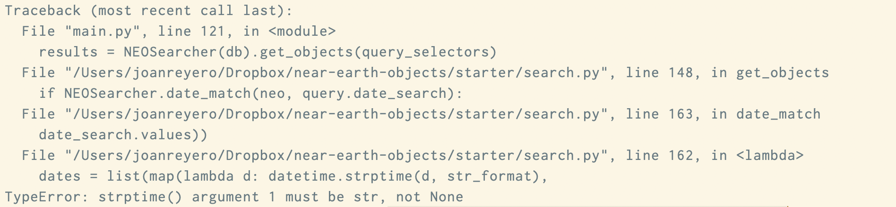
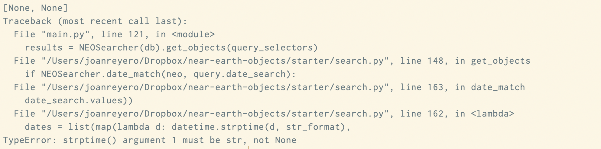
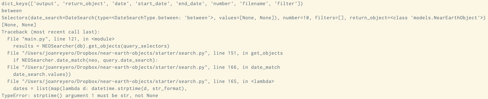

# Table of Contents

1.  [9th Commit](#org2e348c5)
    1.  [Identifying the source of the bug](#orga56b004)
        1.  [What is the error?](#orgb161f01)
        2.  [Confirming the error](#org71e785c)
        3.  [Source of the error](#org016256e)
2.  [10th Commit](#org7726fc9)
    1.  [Fixing the error](#orgf868e1b)
    2.  [Second bug](#org5b89887)
    3.  [Third bug](#org9ab0341)

# 9th Commit

## Identifying the source of the bug

-   After implementing the first search requirment.
-   When `python3 main.py display -n 10 --date 2020-01-01` it gives the following error:

The bug is in line 165 of the 9th commit.

### What is the error?

The argument of `strptime` has been given as None.

-   `str_format` has been defined in the previous line (line 163), therefore it must be `date_search.values`

### Confirming the error

To confirm the suspicions of where the error is, `date_search.values` will be printed in line 164. As the image shows, the output is `[None, None]`, therefore the suspicion is confirmed.

The next steps are backtracing the error to find out where it comes from.

### Source of the error

First, the query in line 150 will be printed to see whether it is okay there. As seen in the image, the values are still `[None, None]`. Moreover, it thinks it is of type `between`, when it should be `equal`. The error, then, comes from before, when implementing the `Query` object.

The problem, therefore, comes from the `__init__` function in `Query`.
That function is built assuming that the parameter-dict `kwargs` only has the keys of the values that it contains. Therefore, it assumes that if the date is of type `equals`, it will not have keys for `start_date` and `end_date`. If it did, the `if` statement in line 45 would be true, and the query parameter `date_search` would be of type between with `None` values.

In order to test this hypothesis, the value of `flags` in line 43 will be printed.

The first line in the image shows that, indeed, all the possible flags are part of the `kwargs` dictionary. Therefore, the source of the bug has been found.

# 10th Commit

## Fixing the error

In order to fix the bug, the `if` statement in line 41 was changed to see whether the values for `start_date` and `end_date` were `None`. This solved the bug.

## Second bug

However, I noticed another bug after that one was solved. `search` was not finding any match between the dates, even when they were equal. The first step was to print the dates when doing the comparisson. With that, I realised that the dates coming from `db` were in a `string` format, rather than `datetime`. Therefore, the bug could simply be solved by converting the string-date to a `datetime` before adding it to the database line 60 in `database.py`

When trying to format the datetime another error occurred. It did not process because it was also trying to add the CSV headers to the database. This was solved adding `next(neo_data, None)` to skip the header, in line 49 in `database.py`.

## Third bug

The search was finding all occurrences of the NEOs in the delected date, instead of the *n* first occurrences.
This was solved by inspection.
I realised `while` loop in line 147 in the 9th commit in `search.py` did not really have much effect, as the `for` loop just after went until completion.

To solve this, the `while` loop was deleted. Instead, an `if` statement was added in line 142 in `search.py` to break the `for` loop when we have found the desired occurrences.
